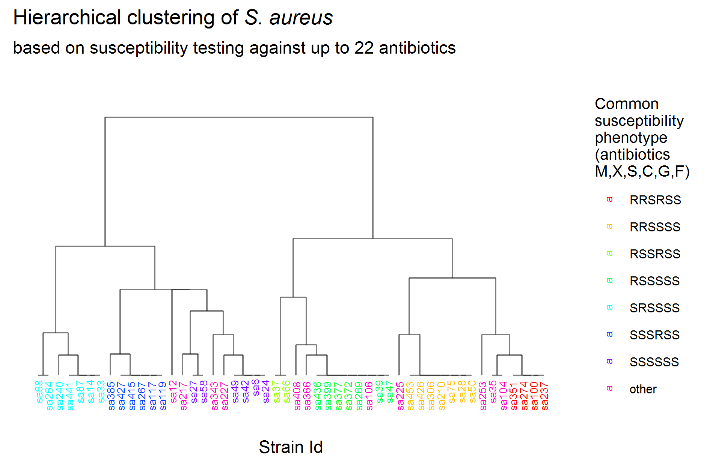

# yea13
Applies the algorithm described by [**Y**pma **e**t **a**l. 20**13**](https://www.ncbi.nlm.nih.gov/pubmed/23922835) to identify putative clusters in a surveillance dataset.

## Installation
Make sure you have [R](https://www.r-project.org/) and package [devtools](https://cran.r-project.org/web/packages/devtools/index.html) installed. Then, type `devtools::install_github("joheli/yea13")` to install package ‘yea13’.

## Data
Data provided represent real surveillance data from a microbiology lab with ids, dates of requests, and unit names altered on data protection grounds.

## The principle

Ypma et al. suggest calculating spatial, genetic, and temporal dissimilarities between occurrences and then multiplying them. The newly generated 'Ypma dissimilarity' is then used to search for clusters, i.e. significantly linked cases.

### Spatial dissimilarity

### Genetic dissimilarity

### Temporal dissimilarity

### References

* Ypma RJ, Donker T, van Ballegooijen WM, Wallinga J. Finding evidence for local transmission of contagious disease in molecular epidemiological datasets. PLoS One. 2013 Jul 26;8(7):e69875.
