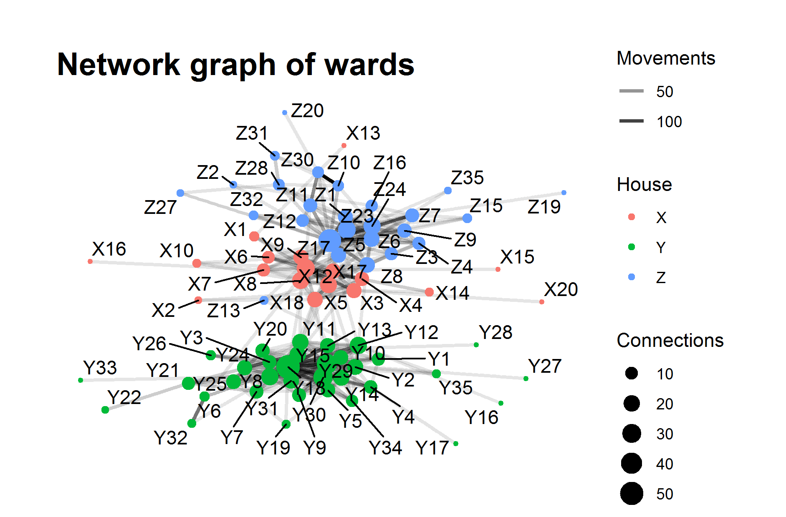
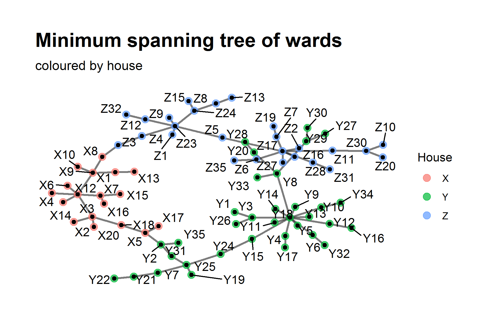
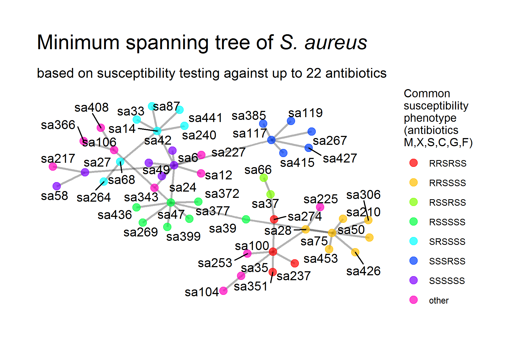

# yea13
Applies the algorithm described by [**Y**pma **e**t **a**l. 20**13**](https://www.ncbi.nlm.nih.gov/pubmed/23922835) to identify putative clusters in a surveillance dataset.

## Installation
Make sure you have [R](https://www.r-project.org/) and package [devtools](https://cran.r-project.org/web/packages/devtools/index.html) installed. Then, type `devtools::install_github("joheli/yea13")` to install package ‘yea13’.

## Data
Data provided represent real surveillance data from a microbiology lab with ids, dates of requests, and unit names altered on data protection grounds.

## The principle

Ypma et al. suggest calculating spatial, genetic, and temporal dissimilarities between occurrences and then multiplying them. The thus generated 'Ypma dissimilarity' is then used to search for clusters, i.e. cases with unusually low dissimilarities between them.

### Spatial dissimilarity

From a graph of units a matrix of 'effective distances' (see package `NetOrigin`) is calculated (see function `graph2effdist`), which serves to estimate a minimum spanning tree between them. The number of nodes between nodes represents the spatial dissimilarities:

### Genetic dissimilarity

For the 'genetic' dissimilarity susceptibility data were chosen for convenience, as genetic typing is not widespread enough yet for most laboratories. Nevertheless, the principle applies, although  for e.g. whole genome MLST the dissimilarities would have to be calculated slightly differently (I would suggest `cluster::daisy` with metric `gower` to this end). 
Be it as it may, the first step is the creation of a distance matrix (visualized with the hierarchical clustering above), which is then translated into a minimum spanning tree; as with the spatial dimension above, the number of nodes between nodes then represents the genetic dissimilarities.

### Temporal dissimilarity

Compared to above dissimilarities the temporal one is fairly easy to calculate; nevertheless, the steps are similar: first, a distance matrix is generated, from which a minimum spanning tree (a linear one without branches in this case) is calculated

### Combining all to generate the 'Ypma dissimilarity'

Multiplication of above dissimilarities creates a matrix of 'Ypma dissimilarities' which are evaluated for the presence of significantly low distance by means of permutation.

## Let's start already

This package is very much in development and probably full of bugs, so please use it at your own risk. Nevertheless, if you're eager to start, install this package and start with function `cluster.search`. Read the manual by entering `?cluster.search` into the R-console.

### References

* Ypma RJ, Donker T, van Ballegooijen WM, Wallinga J. Finding evidence for local transmission of contagious disease in molecular epidemiological datasets. PLoS One. 2013 Jul 26;8(7):e69875.
